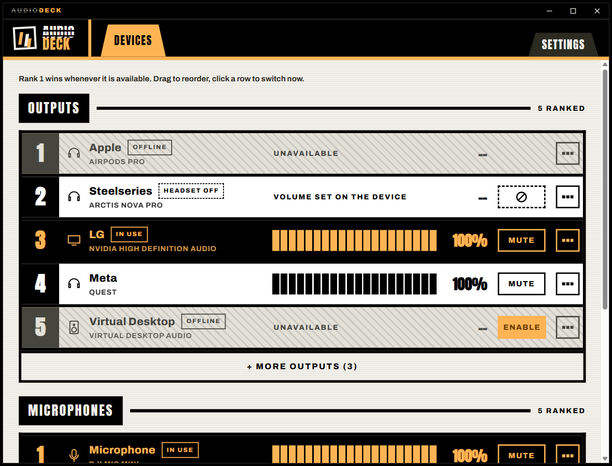
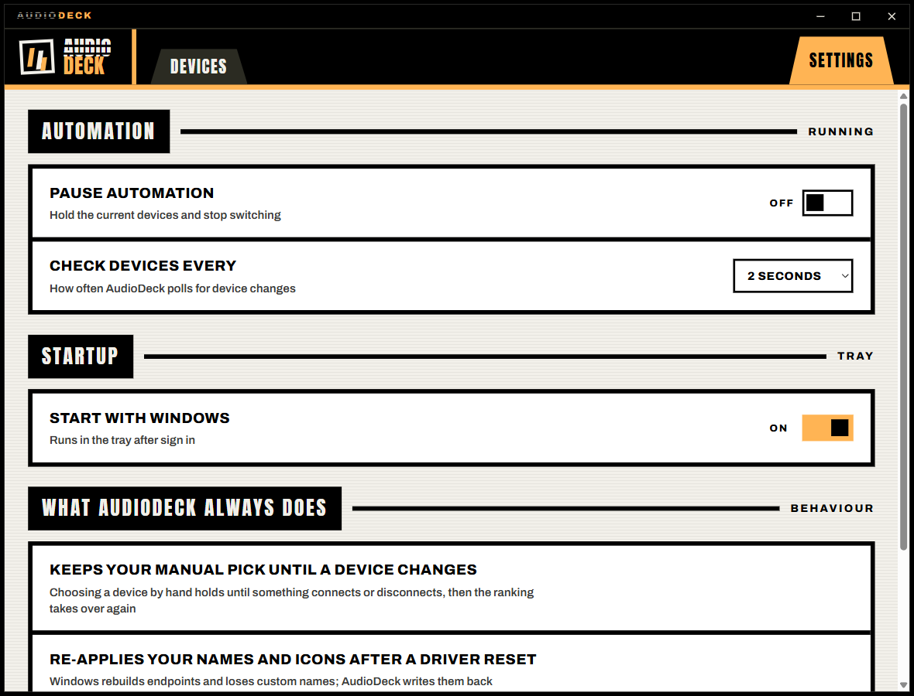

<div align="center">


[](package.json)
[](https://github.com/Maxaubert/AudioDeck)
[](https://www.electronjs.org/)
[](audioctl/)

A tray-resident Windows audio manager: one page listing your audio devices in priority order, each row carrying every control it has.

</div>

## What it fixes

Wireless headsets with an always-powered USB dongle or base station (SteelSeries, Logitech,
Corsair, Razer, HyperX and more) have a problem on Windows: the audio endpoint belongs to the
dongle, which is always plugged in. Windows therefore never notices when you turn the headset
itself off or on, so:

- Turning the headset **off** does not move audio to your speakers or TV.
- Turning it back **on** does not move audio back to the headset.

AudioDeck fixes that, and gathers the rest of Windows audio management (default device, per-device
volumes, enabling and disabling endpoints, renaming) into a single tray app.

## Features

- **Priority auto-switch.** Drag your outputs into the order you want them (microphones have their
  own list). AudioDeck continuously determines which devices are actually available and sets the
  Windows default to the highest-priority available device. Manual overrides are respected: pick a
  different default yourself and automation pauses until the next time some device's availability
  changes.
- **One page, one row per device.** Each row carries volume, mute, and click-to-switch, with the
  device type, rename and enable/disable behind a per-row expander. Renaming applies to Windows
  itself, so every app sees the new name.
- **Only what you use.** Devices outside your priority order stay hidden until you ask for them,
  and the endpoints Windows merely remembers hide one level further in.
- **Honest about what it cannot set.** Hardware that owns its own volume (headset base stations,
  some TVs over HDMI) gets a stamp saying so instead of a fader that does nothing.
- Tray-resident with near-zero idle cost; the window is created on demand and destroyed on close.
- Autostart with Windows (on by default, toggleable), 2 s poll interval (adjustable).

## How detection works

Availability means different things for different devices:

- **Normal devices** (Bluetooth, HDMI, USB speakers): available when the Windows endpoint state is
  `ACTIVE`. This is what Windows already knows.
- **Dongle wireless headsets**: the endpoint is always `ACTIVE`, so AudioDeck additionally asks the
  headset itself, through the dongle, using the bundled
  [HeadsetControl](https://github.com/Sapd/HeadsetControl) tool. A battery status of
  `BATTERY_AVAILABLE` means the headset is powered on; `BATTERY_UNAVAILABLE` means it is off.
  Power-off to switch latency is a poll tick or two (about 2-4 s).

If HeadsetControl reports an error or does not support a headset, that device falls back to normal
endpoint-state detection. AudioDeck fails open: it never switches away from a device it cannot
read.

Supported headsets: see the
[HeadsetControl supported devices list](https://github.com/Sapd/HeadsetControl#supported-headsets).

Under the hood, Windows endpoints are read and written by `audioctl.exe`, a small bundled .NET 8
CLI wrapping Core Audio (IMMDeviceEnumerator, IAudioEndpointVolume, IPolicyConfig), spawned per
operation, JSON in and out.

## Screenshots

| Devices | Settings |
|---|---|
|  |  |

## Install

Grab the latest release from the
[releases page](https://github.com/Maxaubert/AudioDeck/releases):

- **AudioDeck-Setup-x.y.z.exe**, NSIS installer (per-user, choose your install directory).
- **AudioDeck-Portable-x.y.z.exe**, single portable exe, no install.

> [!NOTE]
> Releases are not code-signed yet, so Windows SmartScreen may warn on first run. Choose
> "More info" then "Run anyway", or build from source below.

First run seeds the priority lists with your current Windows default first and the remaining
devices in enumeration order; new devices append to the bottom. Reorder to taste.

## Build from source

Prerequisites: Windows 10/11 x64, Node.js 20+, .NET 8 SDK, PowerShell.

```powershell
git clone https://github.com/Maxaubert/AudioDeck.git
cd AudioDeck
npm install

# 1. Build the Core Audio helper
dotnet publish audioctl -c Release

# 2. Fetch the pinned HeadsetControl binary (v4.0.0) into vendor/
powershell -File scripts/fetch-headsetcontrol.ps1

# 3. Package: NSIS installer + portable exe into dist/
npm run dist
```

Development loop:

```powershell
npm run dev         # electron-vite dev server
npm run typecheck   # baseline gate
npm test            # vitest unit tests (rules engine)
npm run e2e         # Playwright Electron e2e (mock backend)
```

## Third-party credit

AudioDeck bundles [HeadsetControl](https://github.com/Sapd/HeadsetControl) by Denis Arnst (Sapd)
and contributors, licensed under the
[GNU GPL-3.0](https://github.com/Sapd/HeadsetControl/blob/master/LICENSE). AudioDeck invokes
`headsetcontrol.exe` as a separate, unmodified process and does not link against it; its source is
available at the upstream repository. The pinned binary (v4.0.0) is fetched at build time by
`scripts/fetch-headsetcontrol.ps1`.

AudioDeck itself is [MIT licensed](package.json).
